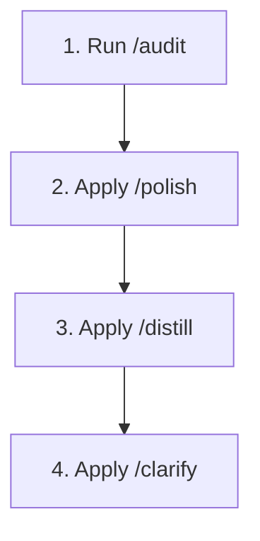

# 🏛️ Aastitva Alliance — Academic Event Infrastructure Platform

> **The First & Only Academic Event Infrastructure Partner in Jammu, J&K, India.**  
> Powers Model United Nations (MUNs), parliamentary debate summits, quizzes, and literary festivals across premier educational institutions.

---

## 🎨 Impeccable Design System Guide (`impeccable.style`)

This project strictly adheres to the **Impeccable Design Vocabulary** (inspired by [impeccable.style](https://impeccable.style/)) to eliminate AI UI slop, over-nested containers, badge soup, and typography clutter.

---

### 📖 How to Apply Impeccable to Any Page (Step-by-Step Guide)

When creating or refining any page (`HomePage`, `SummitPage`, `FounderPage`, `AboutPage`, `OfferingsPage`, etc.), follow this 4-step workflow:



#### Step 1: `/audit` (Scan for AI UI Slop)
Before writing or editing code, audit the page for visual clutter:
- ❌ **Over-Nested Cards**: Are paragraphs wrapped inside unnecessary cards inside cards?
- ❌ **Badge Pill Soup**: Are 3+ uppercase badge pills stacked above headlines?
- ❌ **Raw Browser Emojis**: Are raw emojis (`🏛️`, `⚡`, `🏆`) colliding with serif text?
- ❌ **Theme Breaks**: Does the layout look broken or low-contrast in **Light Mode** or **OLED Dark Mode**?

#### Step 2: `/polish` (Typography & Structural Cleanup)
- **Serif Role (`Cormorant Garamond` / `Playfair Display`)**:
  - Use **strictly** for high-prestige hero titles and editorial pull-quotes.
  - Never use serif fonts inside tiny buttons, form inputs, or badge tags.
- **Sans-Serif Role (`Plus Jakarta Sans` / `Inter`)**:
  - Use for all navigation links, UI buttons, form fields, and body text.
- **Enforce the 80/20 Un-boxed Layout Ratio**:
  - **80% of text** must flow as clean, open text directly on the page background canvas (with left accent lines `border-l-2 border-[#D4AF37] pl-4`).
  - **ONLY 20% of content** (interactive forms, primary action cards, 3D emblem frames) should use card containers.

#### Step 3: `/distill` (Visual Hierarchy & Contrast)
- Ensure every section has **one dominant visual focal point**.
- Primary buttons must use gold shimmers (`shimmer-btn`), while secondary buttons use understated border buttons.
- Subtitle tags must use `.impeccable-header-tag` with explicit 4.5:1+ contrast across all themes.

#### Step 4: `/clarify` (User Actions & Ergonomics)
- Action buttons must state explicit user intent (e.g. *"Schedule Institutional Briefing"* instead of *"Submit"*).
- Touch targets must maintain a minimum height of **44px** for mobile touch ergonomics.

---

## 🛠️ Project Setup & Local Development

### Prerequisites
- Node.js (v18+)
- npm / pnpm

### Quick Start
```bash
# 1. Clone the repository
git clone https://github.com/sarthakbhat2011/Astitva-alliance.git

# 2. Change directory
cd Astitva-alliance

# 3. Install dependencies
npm install

# 4. Start local development server
npm run dev

# 5. Type checking & linting
npm run lint
```

---

## 📄 License
Published under the **MIT License**. Created with excellence for **Aastitva Alliance**.
